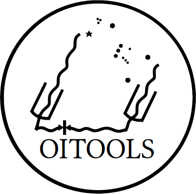

# OITOOLS: the All-in-One Tool Package for Optical Interferometry

| **Documentation**               | **License**                     |**Build**                      |
|:--------------------------------|:--------------------------------|:------------------------------|
| [![][doc-dev-img]][doc-dev-url] | [![][license-img]][license-url] | [![][travis-img]][travis-url] |


[doc-dev-img]: https://img.shields.io/badge/docs-dev-blue.svg
[doc-dev-url]: https://fabienbaron.github.io/OITOOLS.jl/dev

[license-url]: ./LICENSE.md
[license-img]: http://img.shields.io/badge/license-GPL3-brightgreen.svg?style=flat

[travis-img]: https://travis-ci.com/fabienbaron/OITOOLS.jl.svg?branch=master
[travis-url]: https://travis-ci.com/fabienbaron/OITOOLS.jl

OITOOLS is a Julia package to read, plot, model-fit and image optical interferometric data coming from astronomical arrays such as CHARA, VLTI, and NPOI.

## Installation and Documentation

[How To Install](https://fabienbaron.github.io/OITOOLS.jl/dev/install/)

[Documentation](https://fabienbaron.github.io/OITOOLS.jl/dev/)

## Plotting and loading data

* Load and filter data on the fly: split by spectral channel or time

* All the classic plots: uv coverage, V2, T3, etc. by baseline or wavelengths


## Imaging

* Classic image reconstruction


* Polychromatic and dynamical imaging with several regularizations

* OITOOLS is used by the [ROTIR](https://github.com/fabienbaron/ROTIR.jl/) package to do stellar surface imaging.


## Model fitting

* Fast multiple component fitting.

* Polychromatic models (power law, black-body) with spectral line fitting.

* Dynamical models (temporal)

* Optimization with NLOpt and UltraNest.

* Make images from models.

## Observation planning

*Gantt plots like ASPRO (including best POPs solutions)


* CHARA-specific planning


## Simulations

* Simulate future telescope observations

## How to speed up the use of OITOOLS with PackageCompiler

Julia compiles your code on the fly, and functions from OITOOLS are no exception. To significantly decrease the time to run OITOOLS function, you can use PackageCompiler to create a library file that includes OITOOLS. The functions that will be accelerated are the ones included in precompile_oitools.jl from the OITOOLS.jl/demos/ directory. Feel free to add OITOOLS functions that you frequenly use.

```julia
using PackageCompiler
create_sysimage([:OITOOLS], sysimage_path="oitools.so", precompile_execution_file="precompile_oitools.jl")
```
then launch julia with
```
julia --sysimage oitools.so
```
