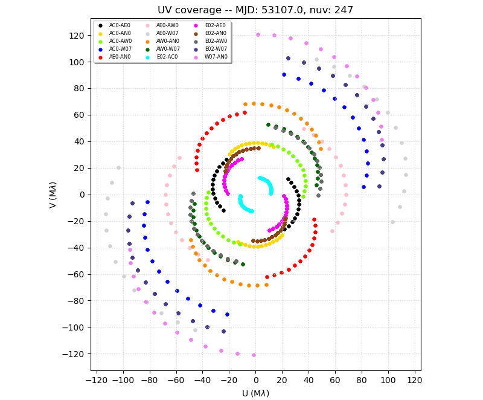
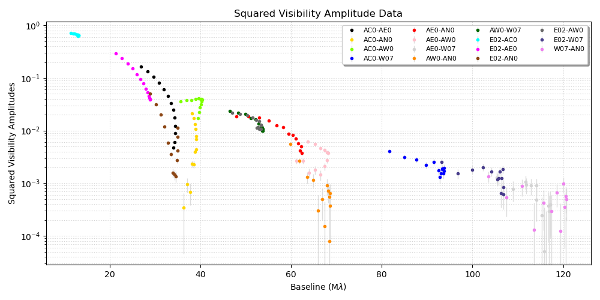
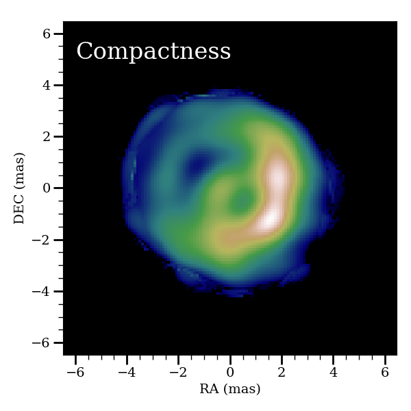
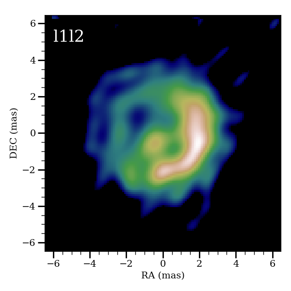
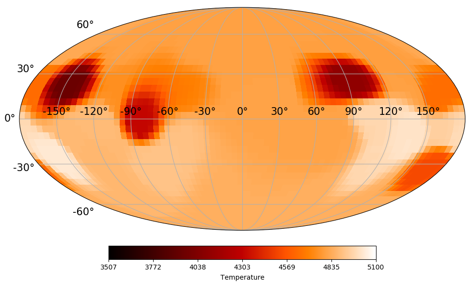
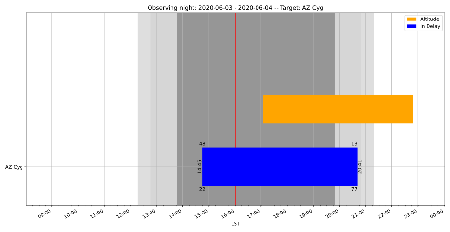
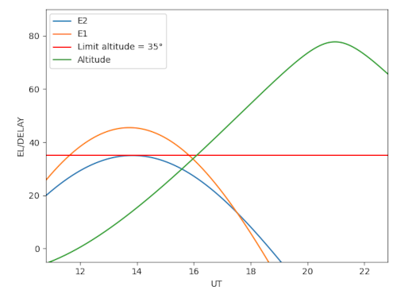

# OITOOLS: the All-in-One Tool Package for Optical Interferometry

|     **Status**                  | **Documentation**               | **License**                     |**Build**                      |
|:--------------------------------|:--------------------------------|:--------------------------------|:------------------------------|
| [![][proj-img]][proj-url] | [![][doc-dev-img]][doc-dev-url] | [![][license-img]][license-url] | [![][build-img]][build-url] |

[proj-img]: http://www.repostatus.org/badges/latest/active.svg
[proj-url]: http://www.repostatus.org/#active

[doc-dev-img]: https://img.shields.io/badge/docs-dev-blue.svg
[doc-dev-url]: https://fabienbaron.github.io/OITOOLS.jl/dev

[license-url]: ./LICENSE.md
[license-img]: http://img.shields.io/badge/license-GPL3-brightgreen.svg?style=flat

[build-img]: https://github.com/fabienbaron/OITOOLS.jl/workflows/CI/badge.svg
[build-url]: https://github.com/fabienbaron/OITOOLS.jl/actions

OITOOLS is a Julia package for optical interferometry data analysis, developed
by Prof. Fabien Baron (Georgia State University) and collaborators. It covers
the full workflow for data from arrays such as CHARA, VLTI, and NPOI:
reading, plotting, model fitting, image reconstruction, and observation
simulation.

### **[:book: Full Documentation](https://fabienbaron.github.io/OITOOLS.jl/dev)**

> **Note:** Despite having the same name as [JMMC's oitools](https://github.com/JMMC-OpenDev/oitools),
> the two packages are completely unrelated and were developed independently.

## Installation

```julia
using Pkg
pkg"registry add General"
pkg"registry add https://github.com/emmt/EmmtRegistry"
Pkg.add(url="https://github.com/fabienbaron/OITOOLS.jl.git")
using OITOOLS
```

Python dependencies (matplotlib for plotting, astroquery for SIMBAD queries, ultranest for
nested sampling) are provisioned automatically by
[CondaPkg](https://github.com/JuliaPy/CondaPkg.jl) the first time you load the package. See
the [installation guide](https://fabienbaron.github.io/OITOOLS.jl/dev/install/) for details,
including how to reuse an existing Python instead.

## Quick start

```julia
using OITOOLS
data = readoifits("mydata.oifits")
uvplot(data)
plot_v2(data)
plot_t3phi(data)
```

## Features

Both image-based and parametric-model-based workflows follow the same pattern:

| Operation | Image domain | Model domain |
|-----------|-------------|-------------|
| → complex visibilities | `image_to_vis(x, ft)` | `model_to_vis(model, x, uv)` |
| → observables | `image_to_obs(x, ft, data)` | `model_to_obs(model, x, data)` |
| → residuals | `image_to_residuals(x, ft, data)` | `model_to_residuals(model, x, data)` |
| → chi² | `image_to_chi2(x, ft, data)` | `model_to_chi2(model, x, data)` |
| → chi² + gradient | `image_to_chi2_fg(x, g, ft, data)` | `model_to_chi2_fg(model, x, data)` |

### Reading OIFITS data

- OIFITS v1 and v2 with automatic quality filtering
- Spectral and temporal binning, polychromatic (per-channel) mode
- OI\_CORR correlation matrices (e.g. GRAVITY)
- `Float32` mode for large datasets (`readoifits(file; T=Float32)`)

### Plotting

All plot functions accept `color="baseline"` (default), `color="wav"`, or
`color="mjd"` to colour-code by baseline, wavelength, or timestamp.

```julia
plot_v2(data; logplot=true, color="wav")        # single observable
plot_obs(data)                                   # multi-panel: V², T3φ, T3amp
plot_obs(data; obs=["V2","T3PHI","VISAMP"], color="mjd")

# After reconstruction or model fitting:
obs = image_to_obs(x, ft, data)                 # or model_to_obs(model, x, data)
plot_residuals(data, obs)                        # data vs model + residuals
plot_residuals(x, ft, data)                      # convenience shortcut

imdisp(image; pixsize=0.1)                       # display a reconstructed image
```

|    **UV coverage**                  | **V²**               |
|:--------------------------------:|:--------------------------------:|
|   |  |

### Model fitting

Parametric model fitting with a flat-dictionary interface compatible with
[PMOIRED](https://github.com/amerand/PMOIRED):

- **Component types:** uniform disk, Gaussian, limb-darkened (linear,
  quadratic, power-law), ring, Gaussian ring, crescent, point source,
  resolved background, and arbitrary radial profiles via Hankel transform
- **Chromatic and time-variable models** using expression strings with
  `$WL`, `$MJD`, and inter-parameter `$`-references
- **Azimuthal modulations** with harmonic coefficients for disk asymmetries
- **Three fitting backends:**
  - NLopt (gradient-based and gradient-free optimizers)
  - LsqFit (Levenberg-Marquardt with covariance and 1-sigma errors)
  - UltraNest (Bayesian nested sampling with log-evidence)
- **Bootstrap error estimation** by baseline, time, or wavelength
- **PMOIRED conversion:** `pmoired_to_julia()` converts Python dict
  literals to Julia

### Image reconstruction

- Gradient-based reconstruction with VMLMB (OptimPackNextGen)
- NFFT for speed or exact DFT
- Polychromatic and time-variable imaging
- SPARCO framework for chromatic environments
- Maximum Entropy (BSMEM) reconstruction
- Multiple regularizations: total variation, L1-L2, compactness,
  entropy, support constraints, and more





The [ROTIR](https://github.com/fabienbaron/ROTIR.jl/) package uses OITOOLS
for stellar surface imaging (light curve inversion, Doppler imaging,
interferometric imaging):



### Observation simulation

- Simulate synthetic OIFITS from images or parametric models
- Build observations from TOML-based array/combiner/wavelength configs
- Pre-built configs for CHARA, VLTI (UT and AT), and their combiners
  (MIRC-X, MYSTIC, GRAVITY, MATISSE, SPICA)
- Observation planning with Gantt charts, delay-line feasibility,
  and SIMBAD target queries

|     **ASPRO-like Gantt chart**                  | **chara\_plan-like plots**               |
|:--------------------------------:|:--------------------------------:|
|  |  |

## Documentation

Full documentation is available at
[fabienbaron.github.io/OITOOLS.jl](https://fabienbaron.github.io/OITOOLS.jl/dev),
including:

- [Reading OIFITS files](https://fabienbaron.github.io/OITOOLS.jl/dev/examples/reading/)
- [Model fitting guide](https://fabienbaron.github.io/OITOOLS.jl/dev/examples/modeling/)
- [Image reconstruction](https://fabienbaron.github.io/OITOOLS.jl/dev/examples/imaging/)
- [Simulation and planning](https://fabienbaron.github.io/OITOOLS.jl/dev/examples/simulating/)
- [Demo scripts](https://fabienbaron.github.io/OITOOLS.jl/dev/examples/intro/)
- API reference: [OIFITS](https://fabienbaron.github.io/OITOOLS.jl/dev/api/oifits/), [Plotting](https://fabienbaron.github.io/OITOOLS.jl/dev/api/plotting/), [Model Fitting](https://fabienbaron.github.io/OITOOLS.jl/dev/api/modeling/), [Imaging](https://fabienbaron.github.io/OITOOLS.jl/dev/api/imaging/), [Observation Planning](https://fabienbaron.github.io/OITOOLS.jl/dev/api/planning/)

## Development install

```julia
using Pkg
pkg"registry add General"
pkg"registry add https://github.com/emmt/EmmtRegistry"
Pkg.develop(url="https://github.com/fabienbaron/OITOOLS.jl.git")
```

Python dependencies (matplotlib, astroquery, ultranest) are declared in `CondaPkg.toml` and
installed automatically into a project-local environment on first `using OITOOLS` — there is
nothing to set up by hand.
